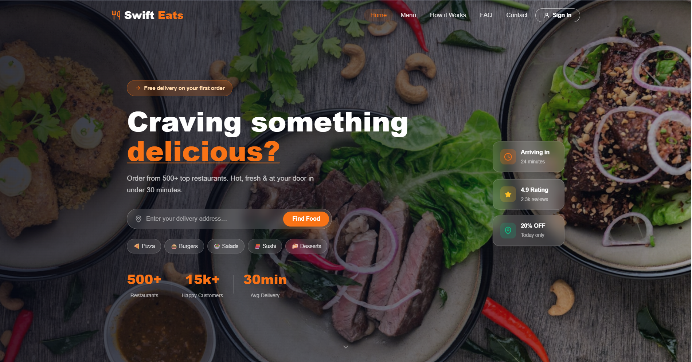
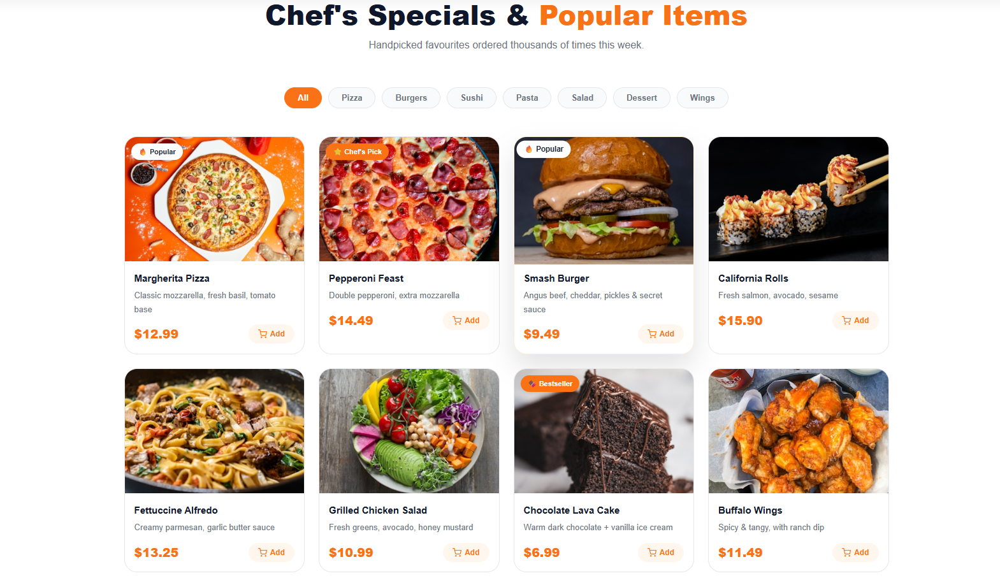
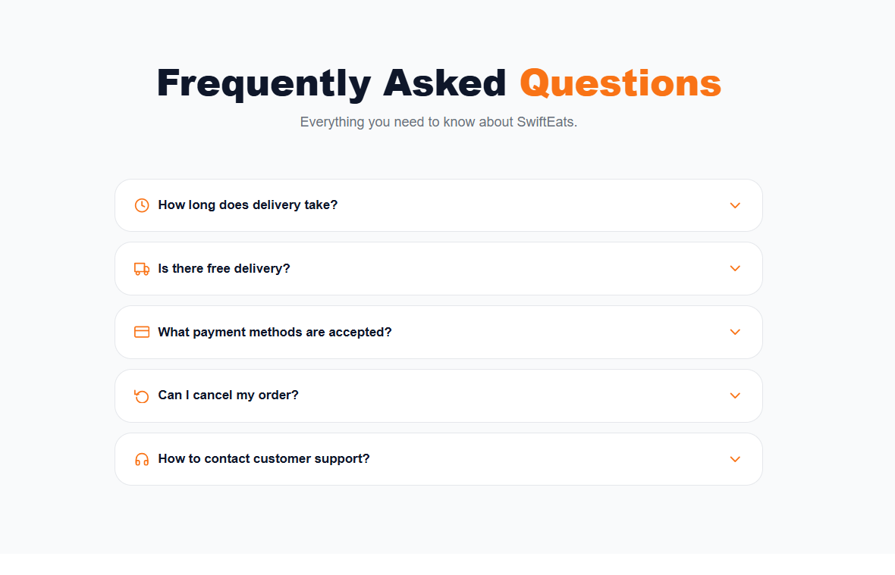
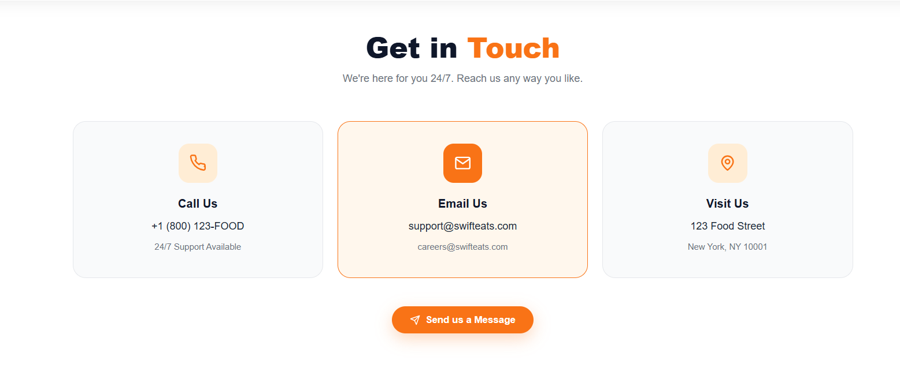
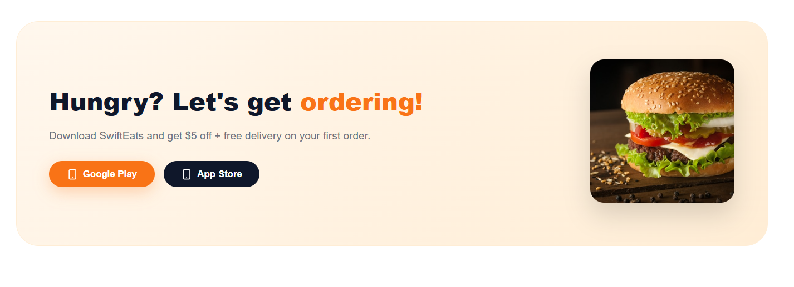
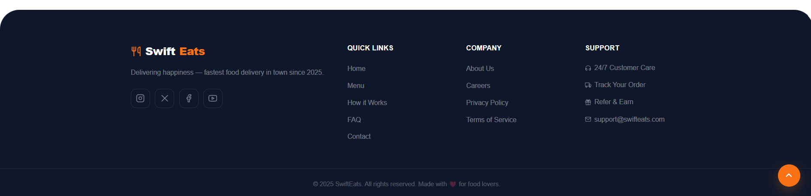

# 🍔 SwiftEats – Premium Food Delivery Landing Page

A modern, fully responsive, and interactive food delivery landing page built with **HTML5, CSS3, and vanilla JavaScript**. Features live menu filtering, FAQ accordion, smooth animations, and smart CTAs — perfect for restaurant aggregators, food startups, or portfolio projects.



---

## 📸 Screenshots

| Section | Preview |
|---------|---------|
| **Hero Section** |  |
| **Why Choose SwiftEats** |  |
| **Menu Section** |  |
| **How It Works** |  |
| **Testimonials** |  |
| **FAQ Section** |  |
| **Contact Section** |  |
| **Ordering Process** |  |
| **Footer** |  |

---

## ✨ Key Features

| Feature | Description |
|---------|-------------|
| 🎨 **Modern UI** | Glassmorphism effects, floating cards, gradient overlays |
| 📱 **Fully Responsive** | Works flawlessly on mobile, tablet, and desktop |
| 🍽️ **Live Menu Filtering** | Filter dishes by category (Pizza, Burger, Sushi, etc.) |
| ❓ **FAQ Accordion** | Expand/collapse questions with smooth animation |
| 🛒 **Add to Cart Simulation** | Interactive buttons with toast notifications |
| 🧭 **Smooth Scroll Nav** | Active link highlighting + sticky navbar |
| ⏳ **Loader Animation** | Professional page load experience |
| 🔝 **Back to Top Button** | Appears after scrolling |
| 👁️ **Scroll Animations** | Intersection Observer for fade-in effects |
| 📞 **Contact Section** | 3 cards with call, email, and address |
| 🔗 **Footer Links** | Quick links, social icons, company info |
| 📲 **App Store CTAs** | Google Play & App Store buttons |
| 🌟 **Hero Stats** | Restaurant count, happy customers, delivery time |
| 🏷️ **Category Tags** | Quick filters for cuisine types |

---

## 🛠️ Tech Stack

- **HTML5** – Semantic structure
- **CSS3** – Flexbox, Grid, custom properties, keyframe animations
- **JavaScript (Vanilla ES6)** – DOM manipulation, event handling, Intersection Observer
- **Lucide Icons** – Clean SVG icon library
- **Google Fonts** – Bricolage Grotesque + DM Sans

---

## 📁 Project Structure

```bash

Restaurant_Food_Delivery_Website_landing_page/
│
├── index.html # Main HTML file
├── style.css # All styles (800+ lines)
├── script.js # All interactions (150+ lines)
│
├── 📸 Screenshots/
│ ├── home.png
│ ├── why choose.png
│ ├── menu.png
│ ├── how it works.png
│ ├── what foodies say.png
│ ├── FAQ.png
│ ├── contact.png
│ ├── ordering.png
│ └── footer.png
│
└── README.md # Documentation
```


> ⚠️ Make sure all files are in the **same folder** as `index.html`

---

## 🚀 Getting Started

### 1. Clone the repository

```bash

git clone https://github.com/yourusername/Restaurant_Food_Delivery_Website_landing_page.git
```
### 2. Navigate into folder
```bash
cd Restaurant_Food_Delivery_Website_landing_page
```
### 3. Run project

Open index.html in your browser
OR use Live Server (VS Code)

## 🎨 Customization
### Colors (style.css)
```bash
:root {
  --orange: #F97316;
  --orange-dark: #EA580C;
  --dark: #0F172A;
  --muted: #6B7280;
}
```

### Update Content
- Menu items → .dish-card
- FAQ → .faq-item
- Contact info → .contact-card
- Images → replace in Screenshots/

## 📱 Responsive Breakpoints

- **≥ 1024px** → Desktop layout  
- **768px – 1024px** → Tablet layout  
- **< 768px** → Mobile layout  
- **< 480px** → Compact mobile layout  

---

## 🔧 JavaScript Features

- Navbar scroll highlight  
- FAQ accordion  
- Menu filtering system  
- Toast notifications  
- Scroll animations (Intersection Observer)  
- Page loader  

---

## 🚨 Browser Support

- Chrome (latest)  
- Firefox (latest)  
- Safari  
- Edge  
- Mobile browsers (iOS / Android)  

---

## 📄 License

MIT License – Free to use, modify, and distribute.

---

## 🙌 Acknowledgments

- Unsplash – High-quality food images  
- Lucide – Clean SVG icon set  
- Google Fonts – Typography resources  
